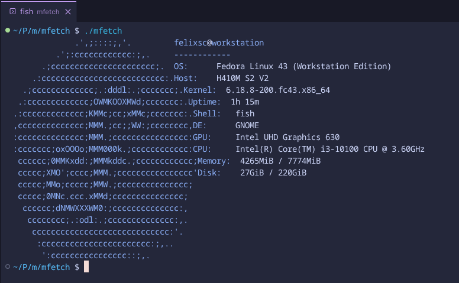
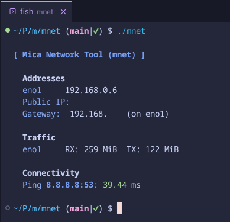

# Mica

Mica is a collection of absolutely **TINY** (under 1MB) tools for Linux. Built for resource-constrained machines (PowerPC, Raspberry Pi 1/Zero, etc.), every tool is statically linked using `musl` and reads data directly from the system kernel.

## Tools

| Tool | Purpose | Size | Docs |
| :--- | :--- | :--- | :--- |
| **mfetch** | Neofetch-style system fetcher | ~77KB | [Docs](docs/mfetch.md) |
| **mnet** | Network status & diagnostic tool | ~111KB | [Docs](docs/mnet.md) |

## Quick Start
 
To build a tool, ensure you have `musl-gcc` installed and run `make` in the respective directory:

```bash
cd mfetch && make
cd ../mnet && make
```

Check the [Building Guide](docs/building.md) for more details.

## Philosophy

1. **Static Everything:** Binaries must be statically linked. Copy the binary and it just works.
2. **Pure Data:** Prefer `/proc` and `/sys` over external library wrappers or command forks.
3. **Small & Stripped:** Optimize for size (`-Os`) and strip symbols.
4. **Musl Powered:** Use the `musl` libc for the smallest possible static footprint.

### Screenshot
<details>
  <summary>Click to expand</summary>
  
  
</details>

---

## mnet
mnet is a fast, lightweight network tool written in C, made to show essential network information with minimal overhead on low-end machines. Information is read directly from the system, not from external commands.

### Features
- Fast and lightweight
- Simple and clean interface
- Written in C and the musl library
- Static binary
- Small file size (111KB)
- Again, no external commands

### Usage
```bash
./mnet
```

or copy the binary to `/usr/local/bin/mnet` and run `mnet`.

### Screenshot
<details>
  <summary>Click to expand</summary>
  
  
</details>

---

### License
mica is licensed under the [MIT License](LICENSE).
